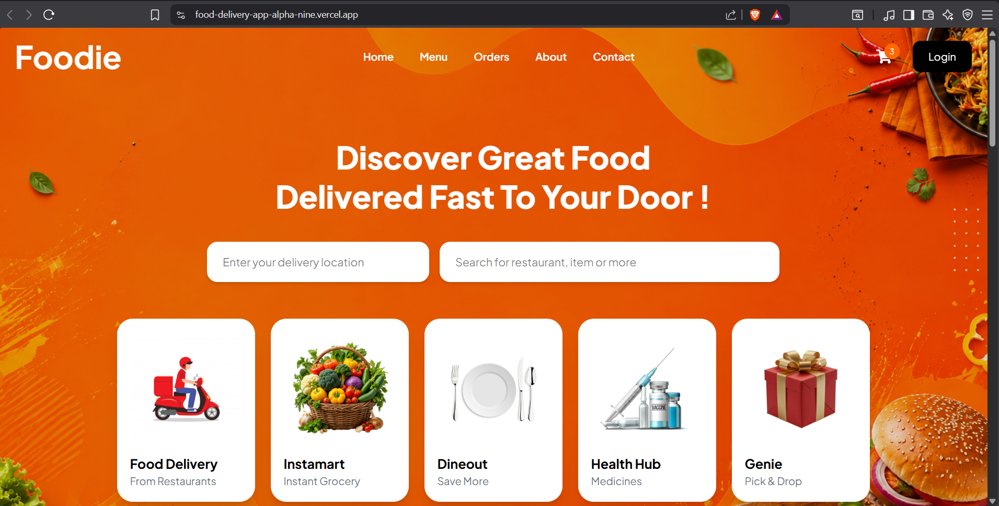
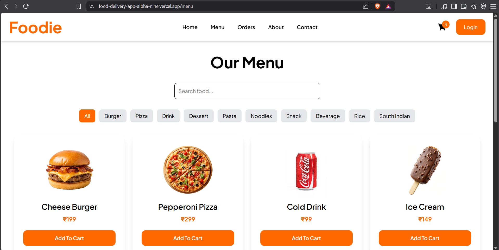
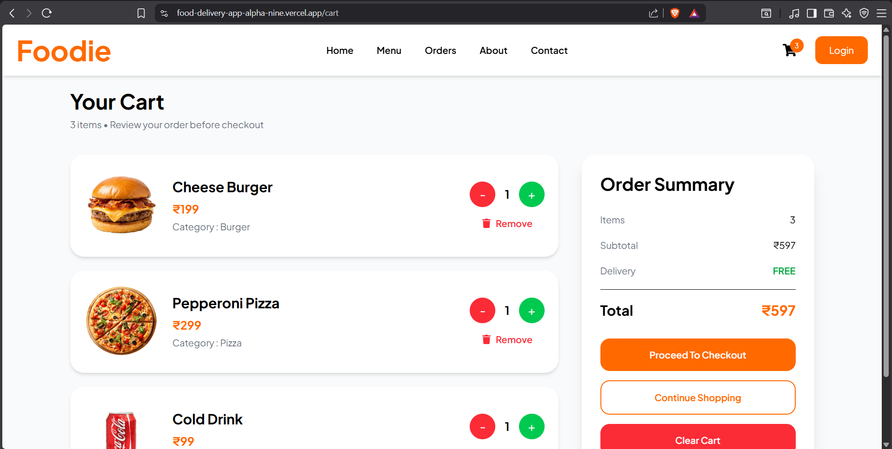
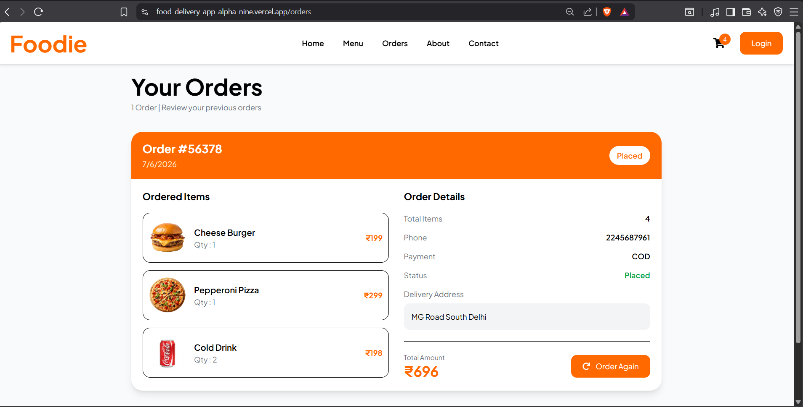

# 🍔 Foodie - Modern Food Delivery Web Application

<p align="center">


</p>

---

## 🚀 Live Demo

🔗 **Live Website**

https://food-delivery-app-alpha-nine.vercel.app

---

# 📖 About

Foodie is a modern and responsive Food Delivery Web Application built using **React**, **Vite**, **Tailwind CSS**, and **Context API**.

The application allows users to browse food items, search meals, filter categories, manage cart items, place orders, and review previous orders through a clean and responsive user interface.

This project was built to strengthen modern frontend development skills using React ecosystem and responsive UI design.

---

# ✨ Features

✅ Beautiful Responsive UI

✅ Search Food

✅ Category Filter

✅ Food Details Page

✅ Add to Cart

✅ Increase / Decrease Quantity

✅ Remove Item

✅ Cart Summary

✅ Checkout Page

✅ Payment Method Selection

- Cash on Delivery
- UPI
- Credit / Debit Card

✅ Order History

✅ Order Again

✅ Context API State Management

✅ Local Storage Support

✅ Mobile Responsive Design

---

# 🛠 Tech Stack

| Technology | Usage |
|------------|------|
| React | Frontend |
| Vite | Build Tool |
| Tailwind CSS | Styling |
| React Router DOM | Routing |
| Context API | Global State |
| React Toastify | Notifications |
| LocalStorage | Data Persistence |

---

# 📷 Screenshots

## 🏠 Home Page

> Add your Home Screenshot here



---

## 🍔 Menu Page

> Add your Menu Screenshot here



---

## 🛒 Cart Page

> Add your Cart Screenshot here



---

## 📦 Orders Page

> Add your Orders Screenshot here



---

# 📂 Project Structure

```text
frontend/

│

├── public/

├── src/

│ ├── assets/

│ ├── components/

│ ├── context/

│ ├── data/

│ ├── hooks/

│ ├── layouts/

│ ├── pages/

│ ├── routes/

│ ├── services/

│ ├── utils/

│

├── App.jsx

├── main.jsx

└── package.json
```

---

# ⚙ Installation

Clone Repository

```bash
git clone https://github.com/codebang45/FOOD-DELIVERY-APP.git
```

Move inside folder

```bash
cd FOOD-DELIVERY-APP
```

Install dependencies

```bash
npm install
```

Run Project

```bash
npm run dev
```

---

# 📱 Responsive Design

Fully Responsive

- 💻 Desktop
- 💻 Laptop
- 📱 Tablet
- 📱 Mobile

---

# 🔥 Current Functionalities

- Browse Menu
- Search Food
- Category Filter
- Add To Cart
- Remove From Cart
- Quantity Control
- Checkout
- Payment Method
- Order Placement
- Order History
- Order Again

---

# 🚀 Upcoming Features

- Node.js Backend
- Express.js API
- MongoDB Database
- JWT Authentication
- User Profile
- Wishlist
- Razorpay Payment Gateway
- Admin Dashboard
- Order Tracking
- Cloudinary Image Upload

---

# 👨‍💻 Developer

**Jatin**

Aspiring Full Stack Developer

---

## 🌐 Connect With Me

GitHub

https://github.com/codebang45

LinkedIn

https://www.linkedin.com/in/jatin-986164326

---

# ⭐ Support

If you liked this project,

⭐ Star this repository

and

🍴 Fork this repository

---

# 📄 License

This project is created for learning purposes.

Feel free to use and modify.

---

<h3 align="center">

Made with ❤️ using React & Tailwind CSS

</h3>